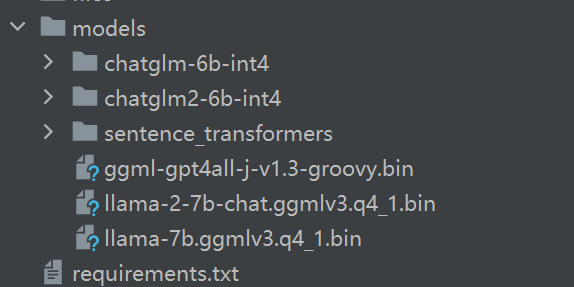

# ChatFile
Chat with file use large language models on your local computer.

## Use langchain + streamlit to do!

## make sure your local disk have this, you can download via the link below

## the link of this is: https://huggingface.co/

## Attention please, if you want to use azure-openai api please modify configure at utils.py(i.e. api-key)
## run

```python
cd code 
streamlit run main.py
```


## open http://localhost:8501 on you browser.

## chose model and wait a moment and click upload.

## it will parse your file.

## model initialize complete.

## you can ask some question about your file.

## enjoy!


## Thanks
### [langchain](https://www.langchain.com/)
### [huggingface](https://huggingface.co/)
### [GPT4ALL](https://gpt4all.io/)
### [ChatGLM-6B](https://github.com/THUDM/ChatGLM-6B)
### [Azure-openai](https://azure.microsoft.com/en-us/products/ai-services/openai-service-b)
